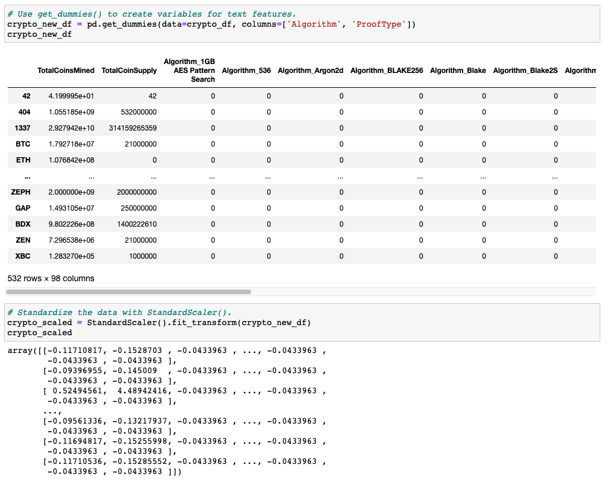

# Cryptocurrencies

# Overview

Accountability Accounting, a prominent investment bank, is interested in offering a new cryptocurrency investment portfolio for its customers. 

Our task is to create a report that includes what cryptocurrencies are on the trading market and how they could be grouped to create a classification system for this new investment.

The data we will be working with is not ideal, so it will need to be processed to fit the machine learning models. Since there is no known output for what we are looking for, we will use unsupervised learning. 

To group the cryptocurrencies, we decided on a clustering algorithm and we'll use data visualizations to share our findings with the board.

For this assignment there are four technical analysis deliverables

- Deliverable 1: Preprocessing the Data for PCA
- Deliverable 2: Reducing Data Dimensions Using PCA
- Deliverable 3: Clustering Cryptocurrencies Using K-means
- Deliverable 4: Visualizing Cryptocurrencies Results

## Deliverable 1: Preprocessing the Data for PCA

## Deliverable 2: Reducing Data Dimensions Using PCA

## Deliverable 3: Clustering Cryptocurrencies Using K-means

## Deliverable 4: Visualizing Cryptocurrencies Results

